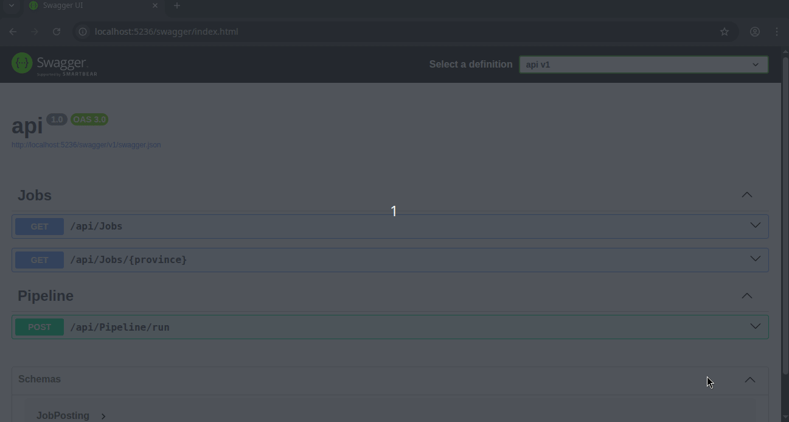

# SA Tech Job Analyzer

This is a full-stack data engineering and business intelligence project designed to scrape job postings, process them through an ETL pipeline, store them in a central database, and make them available for analysis through both a BI dashboard and a backend API.

The project is built with a decoupled architecture, allowing the data pipeline, the API, and the BI tool to all operate on the same central database.

### Project Demo

Here is a demo of the API in action, from running the pipeline to fetching the results:



## Project Components

1.  **Data Pipeline (`src/pipeline`)**: A Python application responsible for the "Extract, Transform, Load" (ETL) process.
    * **Extract**: Scrapes job data from websites (currently using `books.toscrape.com` and `quotes.toscrape.com` as test sources).
    * **Transform**: Cleans the raw data using `pandas` to standardize salaries, normalize locations into provinces, and extract key skills (like 'React', 'SQL Server', 'Power BI', etc.).
    * **Load**: Loads the cleaned data into a staging table in a SQL Server database, then executes a `MERGE` statement to upsert the data into the final `JobPostings` table.

2.  **Backend API (`src/api`)**: An ASP.NET Core Web API that acts as the primary service layer.
    * **Serves Data**: Exposes `GET` endpoints (like `/api/jobs` and `/api/jobs/{province}`) to serve the cleaned data from the database.
    * **Triggers Pipeline**: Exposes a `POST /api/pipeline/run` endpoint that executes the Python ETL script as a background process.
    * **Manages Database**: Uses Entity Framework Core to manage the database schema. It automatically runs any pending migrations on startup to create tables like `JobPostings`.

3.  **Database (`TechJobsDB`)**: A Microsoft SQL Server database that acts as the "single source of truth" for the entire application.

4.  **Business Intelligence (`Metabase`)**: A lightweight, open-source BI tool (running from a `.jar` file) that connects directly to the `TechJobsDB` for building real-time, interactive dashboards.

## Technology Stack

* **Backend**: C# 12, ASP.NET Core 10, Entity Framework Core 10
* **Data Pipeline**: Python 3.12, Pandas, SQLAlchemy, BeautifulSoup4, PyODBC
* **Database**: Microsoft SQL Server (running on Linux)
* **Business Intelligence**: Metabase (Java)
* **Environment**: Linux (Ubuntu), .NET User Secrets

## Setup and Installation

Follow these steps to get the entire project running on a new machine.

### Prerequisites

* .NET 10 SDK (or your current version)
* Python 3.12
* Microsoft SQL Server for Linux (must be installed and running)
* Java JRE (for Metabase)

### 1. Database Setup

1.  Ensure your SQL Server instance is running.
2.  Your Python pipeline and ASP.NET API will *automatically create the `TechJobsDB` database* if it doesn't exist, and the API will create the `JobPostings` table.

### 2. Data Pipeline Setup (Python)

This component will be run by the API, but it needs its own dependencies installed.

```bash
# 1. Navigate to the pipeline directory
cd src/pipeline

# 2. Create and activate a virtual environment
python -m venv .venv
source .venv/bin/activate

# 3. Install Python packages
pip install -r requirements.txt

# 4. Create the environment file
nano .env
````

Paste the following into your `.env` file, replacing the values with your actual SQL Server credentials:

```
# .env file
DB_HOST=localhost
DB_NAME=TechJobsDB
DB_USER=your_sql_username
DB_PASSWORD=your_sql_password
```

### 3\. Backend API Setup (ASP.NET Core)

The API needs to connect to the same database. We will use `.NET user-secrets` to store the connection string securely (as recommended in your `appsettings.json`).

```bash
# 1. Navigate to the API directory
cd src/api

# 2. Initialize user-secrets
dotnet user-secrets init

# 3. Set the connection string
# (Replace with your username/password)
dotnet user-secrets set "ConnectionStrings:DefaultConnection" "Server=localhost;Database=TechJobsDB;User Id=your_sql_username;Password=your_sql_password;TrustServerCertificate=True"

# 4. Run the API
dotnet run
```

When you run the API, its terminal will show:

1.  That it's "Applying migration 'InitialSchema'..." (This is EF Core creating your tables).
2.  The URL it's listening on (e.g., `http://localhost:5236`).

### 4\. Business Intelligence Setup (Metabase)

1.  Download the Metabase `.jar` file (e.g., to your Home directory).
2.  In a **new terminal**, run Metabase:
    ```bash
    java -jar metabase.jar
    ```

## How to Use the Project

1.  **Start the API:** In one terminal, run `dotnet run` from the `src/api` folder.
2.  **Start Metabase:** In a second terminal, run `java -jar metabase.jar`.
3.  **Run the Pipeline:**
      * Open your browser to the API's Swagger page (e.g., `http://localhost:5236/swagger`).
      * Find the `POST /api/pipeline/run` endpoint.
      * Click "Try it out," then "Execute."
      * You will see the live logs from your Python script appear in your API's terminal window.
4.  **View Data in the API:**
      * Go back to the Swagger page.
      * Execute `GET /api/jobs`. You will see the JSON data for all the jobs the pipeline just loaded.
5.  **Build Dashboards in Metabase:**
      * Open Metabase in your browser at `http://localhost:3000`.
      * Complete the setup (create your admin user).
      * Connect to your `TechJobsDB` (using `localhost`, `1433`, and your credentials).
      * You can now see the `JobPostings` table and start building your BI dashboards.

<!-- end list -->